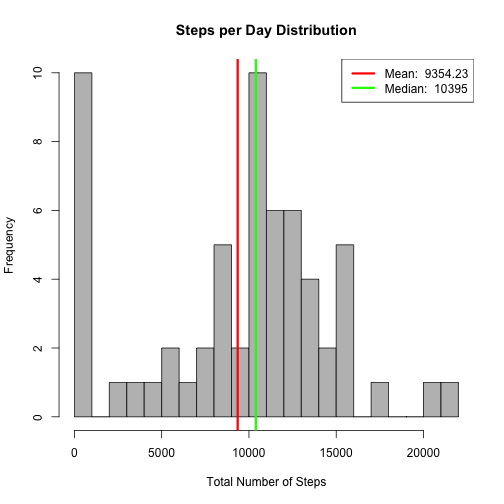
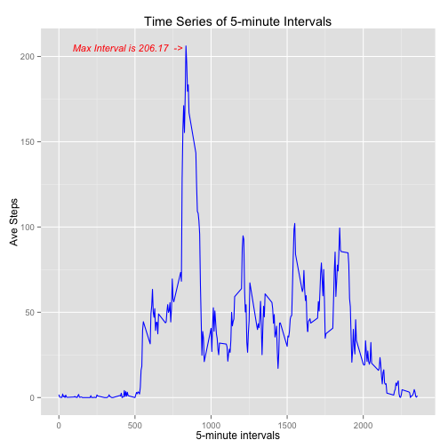
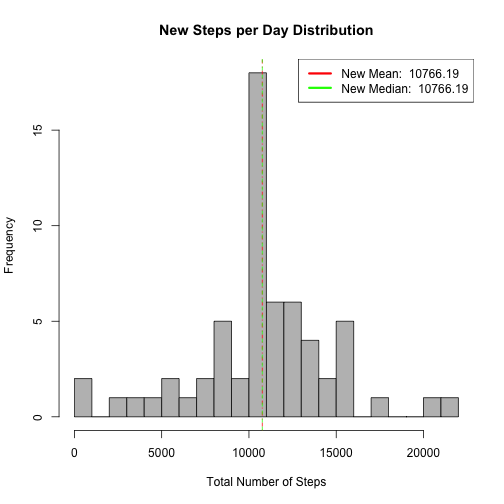

Reproducible Research Peer Assignment 1
Produced by Max K. Goff
17 May 2015
---
title: "Reproducible Research: Peer Assessment 1"
output: 
  html_document:
    keep_md: true
---


## Loading and preprocessing the data

Show any code that is needed to

1. Load the data


```r
options(warn=-1)
library(ggplot2)
library(data.table)
library(grid)
library(lattice)
library(knitr)
echo = TRUE  #  make code visible

# now load the data
unzip("activitiy.zip")
activityData <- read.csv("activity.csv", colClasses = c("integer", "Date", "factor"))
aT <- data.table(activityData)
```

2. Process/transform the data (if necessary) into a format suitable for your analysis


```r
# elminita NAs
aS <-  aT[, list(totSteps = sum(steps, na.rm = TRUE)), by = date]
```

## What is mean total number of steps taken per day?

For this part of the assignment, you can ignore the missing values in the dataset.

1. Calculate the total number of steps taken per day


```r
# the incomplete cases were previously removed
 
 
smean<- round(mean(aS$totSteps), digits = 2)
smedian<- median(aS$totSteps)
prt <- c("mean:", round(smean, digits=2), "  median:", smedian)
prt
```

```
## [1] "mean:"     "9354.23"   "  median:" "10395"
```

2. If you do not understand the difference between a historgram and a barplot, research the difference between them.  Make a histogram of the total number of steps taken each day.

3. Calcuate and report the mean and median of the total numer of steps taken per day.


```r
 # Histograms are used to show distributions of variables.
 # Barplots are used to compare variables.
 # This histogram depicts the total number of steps each day, based on frequency.
 

hist(aS$totSteps, breaks=30, main = "Steps per Day Distribution",xlab = 'Total Number of Steps', col = 'grey') 

#  And now add the mean and median values to the histogram.
abline(v=smean, lwd = 3, col = 'red')
abline(v=smedian, lwd = 3, col = 'green')

legend('topright', lty = 1, lwd = 3, col = c("red", "green"),
        legend = c(paste('Mean: ', smean), paste('Median: ', smedian)))               
```

 

## What is the average daily activity pattern?

1. Make a time series plot (i.e. type = "l") of the 5-minute interval (x-axis) and the average number of steps taken, averaged across all days (y-axis)

2. Which 5-minute interval, on average across all the days in the dataset, contains the maximum number of steps?


```r
# Eliminate the NAs, calculate the average over each interval and add a new column
aTnona <- na.omit(aT)
avStep <- aggregate(aTnona$steps, list(interval = as.numeric(as.character(aTnona$interval))), FUN = "mean")
names(avStep)[2] <- "meanStep"

# Get the maximum value and prepare the time series plot; include the maximum interval 
smax<-max(avStep$meanStep)
mgrob<- grobTree(textGrob(paste("Max Interval is", round(smax, digits=2), " ->"), x=0.22, y=0.95),gp=gpar(col="red", fontsize=11, fontface="italic"))
ggplot(avStep, aes(interval, meanStep)) + geom_line(color = "blue", size = 0.5) + labs(title = "Time Series of 5-minute Intervals", x = "5-minute intervals", y = "Ave Steps")  + annotation_custom(mgrob)
```

 

## Imputing missing values

Note that there are a number of days/intervals where there are missing values (coded as NA). The presence of missing days may introduce bias into some calculations or summaries of the data.

1. Calculate and report the total number of missing values in the dataset (i.e. the total number of rows with NAs)


```r
missingValuesCount<- sum(is.na(aT$steps))
rpt<- paste("Of ", length(aT$steps),  " there are ", missingValuesCount, " missing values.")
print(rpt)
```

```
## [1] "Of  17568  there are  2304  missing values."
```


2. Devise a strategy for filling in all of the missing values in the dataset. The strategy does not need to be sophisticated. For example, you could use the mean/median for that day, or the mean for that 5-minute interval, etc.

3. Create a new dataset that is equal to the original dataset but with the missing data filled in.

4. Make a histogram of the total number of steps taken each day and Calculate and report the mean and median total number of steps taken per day. Do these values differ from the estimates from the first part of the assignment? What is the impact of imputing missing data on the estimates of the total daily number of steps?


```r
new_aT <- aT
setkey(aT, interval)
setkey(new_aT, interval)

# set up a fuctnio to replace missing step values with the interval average

replaceNA <- function(x,y){ 
    if(is.na(x)){ return(y)} 
    return(x)
    }
aTnona = aT[, list(avg_steps = mean(steps, na.rm = T)), 
                          by = interval]
new_aTa = new_aT[aTnona]
new_aTa$steps = mapply(replaceNA,new_aTa$steps, new_aTa$avg_steps)


# prepare and plot the new histogram
new_avStep <- aggregate(new_aTa$steps, list(interval = as.numeric(as.character(new_aTa$interval))), FUN = "mean")
names(new_avStep)[2] <- "meanStep"

new_aS <-  new_aTa[, list(totSteps = sum(steps, na.rm = TRUE)), by = date]

new_smean<- round(mean(new_aS$totSteps), digits = 2)
new_smedian<- round(median(new_aS$totSteps), digits = 2)
hist(new_aS$totSteps, breaks=30, main = "New Steps per Day Distribution",xlab = 'Total Number of Steps', col = 'grey') 


abline(v=new_smean, lty = 4, col = 'red')
abline(v=new_smedian, lty = 2, col = 'green')


legend('topright', lty = 1, lwd = 3, col = c("red", "green"),
        legend = c(paste('New Mean: ', new_smean), paste('New Median: ', new_smedian)))   
```

 


The impact of replacing the missing values raises both values, and brings the median and average values together, and creaties more of a normal distribtuion.


## Are there differences in activity patterns between weekdays and weekends?

For this part the weekdays() function may be of some help here. Use the dataset with the filled-in missing values for this part.

1. Create a new factor variable in the dataset with two levels – “weekday” and “weekend” indicating whether a given date is a weekday or weekend day.


```r
# This function will return the categorical values
WeekDate <- function(date){
    t <- weekdays(date)
    if( t %in% c("Monday", "Tuesday", "Wednesday", "Thursday", "Friday"))
        return("weekday")
    return("weekend")
}

# Create a new colum with date classification (weekend or weekday)
new_aTa$weekDay <- sapply(new_aTa$date, FUN=WeekDate)
```
2. Make a panel plot containing a time series plot (i.e. type = "l") of the 5-minute interval (x-axis) and the average number of steps taken, averaged across all weekday days or weekend days (y-axis). See the README file in the GitHub repository to see an example of what this plot should look like using simulated data.


```r
#  First aggregate the average number of interval steps based on week date classification
avgSteps <- aggregate(new_aTa$steps, list(interval = as.numeric(as.character(new_aTa$interval)), 
                           weekdays = new_aTa$weekDay),FUN = "mean")
names(avgSteps)[3] <- "meanSteps"

# Finally, plot the two similar to the example in the original repo
xyplot(avgSteps$meanSteps ~ avgSteps$interval | avgSteps$weekdays, 
       layout = c(1, 2), type = "l",  xlab = "Interval", ylab = "Number of steps")
```

 


```r
knit2html("PA1_template.Rmd")
```

```
## 
## 
## processing file: PA1_template.Rmd
```

```
## 
  |                                                                       
  |                                                                 |   0%
  |                                                                       
  |...                                                              |   5%
##   ordinary text without R code
## 
## 
  |                                                                       
  |......                                                           |  10%
## label: unnamed-chunk-11
## 
  |                                                                       
  |.........                                                        |  14%
##   ordinary text without R code
## 
## 
  |                                                                       
  |............                                                     |  19%
## label: unnamed-chunk-12
## 
  |                                                                       
  |...............                                                  |  24%
##   ordinary text without R code
## 
## 
  |                                                                       
  |...................                                              |  29%
## label: unnamed-chunk-13
## 
  |                                                                       
  |......................                                           |  33%
##   ordinary text without R code
## 
## 
  |                                                                       
  |.........................                                        |  38%
## label: unnamed-chunk-14
```

```
## 
  |                                                                       
  |............................                                     |  43%
##   ordinary text without R code
## 
## 
  |                                                                       
  |...............................                                  |  48%
## label: unnamed-chunk-15
```

```
## 
  |                                                                       
  |..................................                               |  52%
##   ordinary text without R code
## 
## 
  |                                                                       
  |.....................................                            |  57%
## label: unnamed-chunk-16
## 
  |                                                                       
  |........................................                         |  62%
##   ordinary text without R code
## 
## 
  |                                                                       
  |...........................................                      |  67%
## label: unnamed-chunk-17
```

```
## 
  |                                                                       
  |..............................................                   |  71%
##   ordinary text without R code
## 
## 
  |                                                                       
  |..................................................               |  76%
## label: unnamed-chunk-18
## 
  |                                                                       
  |.....................................................            |  81%
##   ordinary text without R code
## 
## 
  |                                                                       
  |........................................................         |  86%
## label: unnamed-chunk-19
```

```
## 
  |                                                                       
  |...........................................................      |  90%
##   ordinary text without R code
## 
## 
  |                                                                       
  |..............................................................   |  95%
## label: unnamed-chunk-20
```

```
## 
  |                                                                       
  |.................................................................| 100%
##   ordinary text without R code
```

```
## output file: PA1_template.md
```

